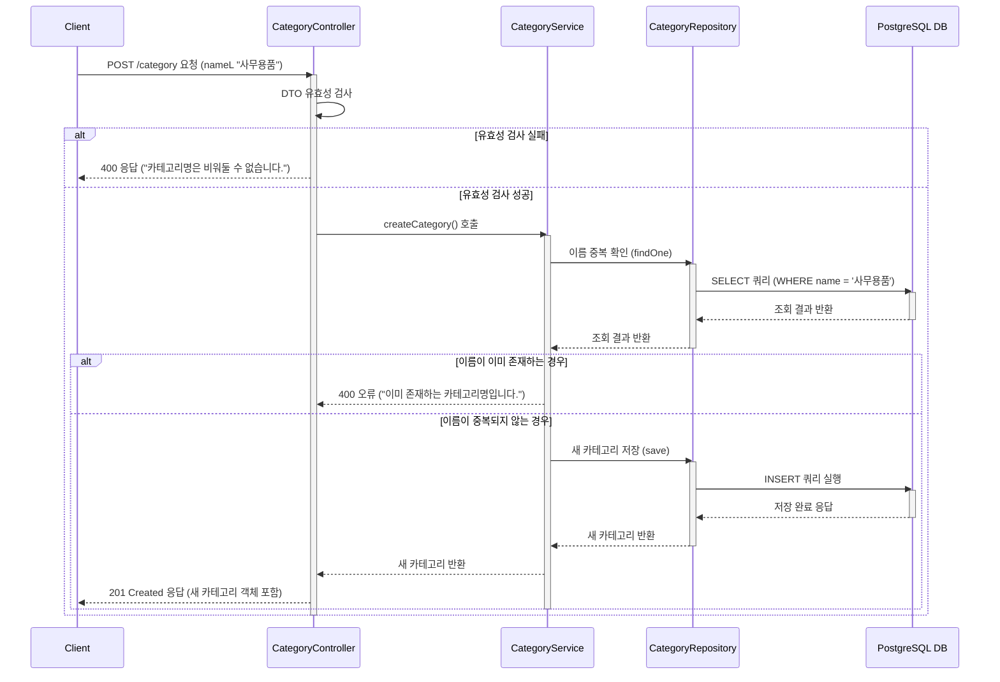

# 카테고리 생성

## 엔드포인트 (Endpoint)

`POST /category`

## 기능 설명 (Description)

새로운 카테고리를 시스템에 등록합니다. 카테고리명은 중복될 수 없습니다.

## 흐름도

## 상세 설명

### 성공 흐름

1.  **요청 및 유효성 검사**: 사용자는 생성할 카테고리 이름을 `Request Body`에 담아 `POST /category`로 요청합니다. `Controller`는 NestJS의 `ValidationPipe`를 통해 DTO(Data Transfer Object)의 유효성을 자동으로 검사합니다. (예: `name` 필드가 비어있지 않은지)
2.  **이름 중복 확인**: `Controller`는 `Service`의 `createCategory()`를 호출합니다. `Service`는 DB에 동일한 이름의 카테고리가 이미 존재하는지 `Repository`를 통해 확인합니다.
3.  **데이터 저장**: 중복되는 이름이 없으면 `Service`는 새로운 카테고리 객체를 생성하고, `Repository`의 `save()` 메서드를 호출하여 DB에 `INSERT` 쿼리를 실행합니다.
4.  **성공 응답**: 데이터가 성공적으로 저장되면, `id`가 부여된 새로운 카테고리 객체가 DB로부터 반환됩니다. 이 객체는 Repository → Service → Controller 순으로 전달되어 최종적으로 사용자에게 `201 Created` 상태 코드와 함께 응답됩니다.

### 예외 처리 (Exception Handling)

- **유효성 검사 실패**: 요청한 `name` 값이 비어있거나 문자열이 아닌 경우, `Controller` 단에서 즉시 `400 Bad Request` 오류를 반환합니다.
- **이름 중복**: 저장하려는 `name`이 DB에 이미 존재할 경우, `Service` 단에서 `BadRequestException`을 발생시켜 `400 Bad Request` 오류를 반환합니다.
