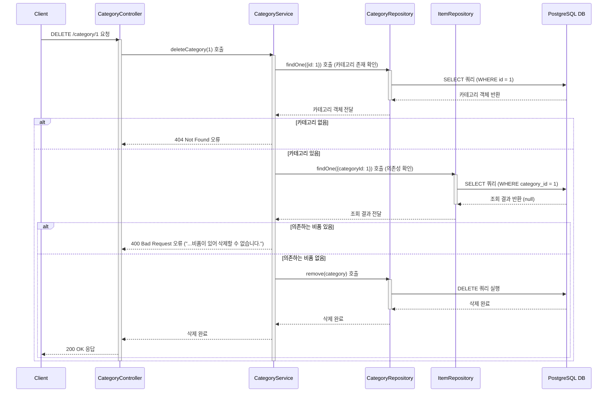

# 카테고리 생성

## 엔드포인트 (Endpoint)

    `DELETE /category/{id}`

## 기능 설명 (Description)

    지정된 `id`를 가진 카테고리를 삭제합니다. 단, 해당 카테고리에 속한 비품(Item)이 하나라도 있으면 삭제할 수 없습니다.

## 흐름도

## 상세 설명

### 성공 흐름

1.  **요청**: 사용자가 삭제할 카테고리의 `id`를 담아 `DELETE /category/{id}`로 요청합니다.
2.  **카테고리 조회**: `Service`는 `id`를 이용해 `Repository`에 해당 카테고리가 존재하는지 조회합니다.
3.  **의존성 확인**: 카테고리가 존재하면, `Item` 테이블을 조회하여 해당 카테고리를 참조하는 비품이 있는지 확인합니다.
4.  **데이터 삭제**: 의존하는 비품이 없으면, `Repository`의 `remove()` 메서드를 호출하여 DB에서 해당 카테고리 데이터를 `DELETE` 합니다.
5.  **성공 응답**: 삭제가 성공적으로 완료되면 사용자에게 `200 OK` 상태 코드를 응답합니다.

### 예외 처리 (Exception Handling)

- **카테고리 없음**: URL에 포함된 `id`에 해당하는 카테고리가 존재하지 않으면 `404 Not Found` 오류를 반환합니다.
- **의존성 존재**: 삭제하려는 카테고리에 속한 비품이 하나 이상 존재할 경우, "해당 카테고리에 속한 비품이 있어 삭제할 수 없습니다." 메시지와 함께 `400 Bad Request` 오류를 반환합니다.
