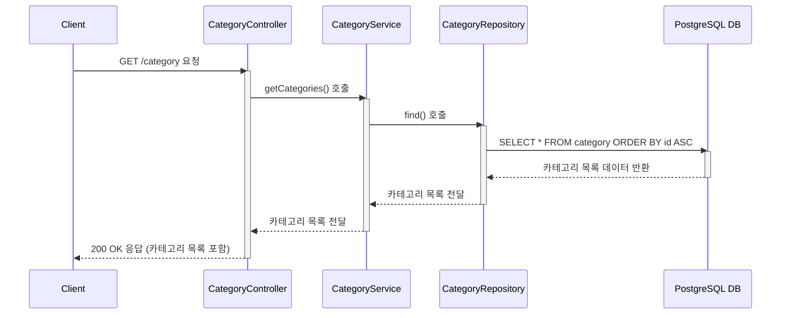

# 카테고리 생성

## 엔드포인트 (Endpoint)

    `GET /category`

## 기능 설명 (Description)

    시스템에 등록된 모든 카테고리 목록을 조회하여 배열 형태로 반환합니다.

## 흐름도

## 상세 설명

### 성공 흐름

1.  **요청**: 사용자가 `GET /category` 엔드포인트로 API를 요청합니다.
2.  **서비스 호출**: `CategoryController`는 요청을 받아 `CategoryService`의 `getCategories()` 메서드를 호출합니다.
3.  **데이터 조회**: `CategoryService`는 `CategoryRepository`의 `find()` 메서드를 통해 데이터베이스에 모든 카테고리 목록을 조회하는 쿼리를 실행합니다. (`id` 기준 오름차순으로 정렬됩니다.)
4.  **성공 응답**: `Repository`는 조회된 카테고리 목록을 `Service`와 `Controller`를 거쳐 사용자에게 반환합니다. 최종적으로 사용자는 `200 OK` 상태 코드와 함께 카테고리 객체들이 담긴 배열을 응답받습니다.

### 예외 처리 (Exception Handling)

- 이 기능은 특정 비즈니스 로직에 따른 예외를 발생시키지 않습니다. 데이터베이스 연결 실패 등 서버의 일반적인 오류 발생 시, 전역 예외 필터(`AllExceptionsFilter`)가 `500 Internal Server Error`를 반환합니다.
