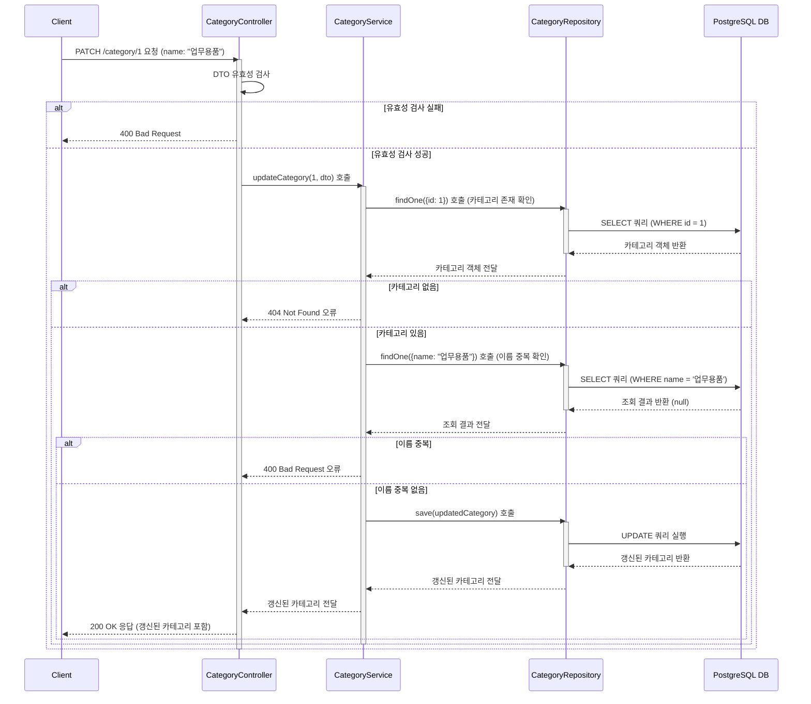

# 카테고리 생성

## 엔드포인트 (Endpoint)

    `PATCH /category/{id}`

## 기능 설명 (Description)

    URL 경로에 포함된 `id`와 일치하는 카테고리 정보를 수정합니다.

## 흐름도

## 상세 설명

### 성공 흐름

1.  **요청 및 유효성 검사**: 사용자가 수정할 `id`와 정보를 담아 `PATCH` 요청을 보냅니다. `Controller`는 요청 본문(DTO)의 유효성을 먼저 검사합니다.
2.  **카테고리 조회**: `Service`는 `id`를 이용해 `Repository`에 해당 카테고리가 존재하는지 조회합니다.
3.  **이름 중복 확인**: 카테고리가 존재하면, 변경하려는 이름이 이미 다른 카테고리에서 사용 중인지 다시 `Repository`를 통해 확인합니다.
4.  **데이터 갱신**: 모든 검사를 통과하면, `Service`는 카테고리 객체의 정보를 수정한 뒤 `Repository`의 `save()` 메서드를 호출하여 DB에 `UPDATE` 쿼리를 실행합니다.

### 예외 처리 (Exception Handling)

- **유효성 검사 실패**: 요청 본문의 `name` 값이 비어있는 등 형식에 맞지 않으면 `400 Bad Request` 오류를 반환합니다.
- **카테고리 중복**: URL에 포함된 `id`에 해당하는 카테고리가 존재하지 않으면 `404 Not Found` 오류를 반환합니다.
- **이름 중복**: 변경하려는 `name`이 이미 DB에 존재하면 `400 Bad Request` 오류를 반환합니다.
