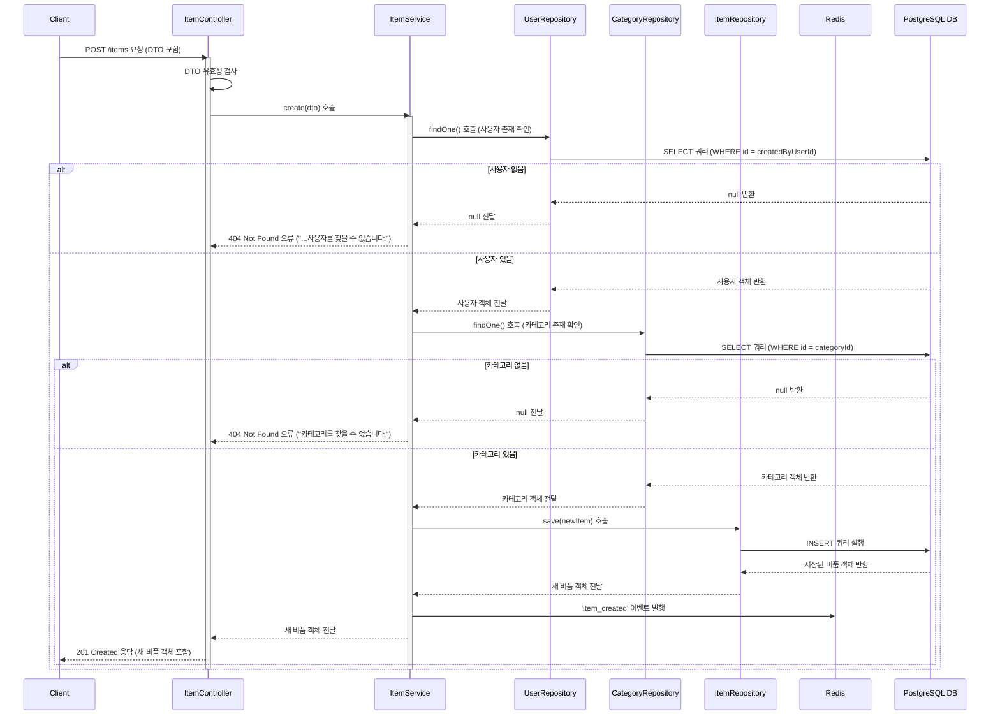

# 카테고리 생성

## 엔드포인트 (Endpoint)

    `POST /items`

## 기능 설명 (Description)

새로운 비품을 시스템에 등록합니다. 비품은 반드시 존재하는 **사용자(User)** 와 **카테고리(Category)** 에 속해야 합니다. 등록 성공 시 Redis로 `item_created` 이벤트를 발행합니다.

## 흐름도

## 상세 설명

### 성공 흐름

1.  **요청 및 유효성 검사**: 사용자가 생성할 비품 정보를 `Request Body`에 담아 `POST /items`로 요청합니다. 이때 `Controller`는 DTO의 유효성을 검사합니다.
2.  **참조 데이터 확인**: `Service`는 `create()` 메서드 내에서 다음을 순서대로 확인합니다.

- `UserRepository`를 통해 `createdByUserId`에 해당하는 사용자가 존재하는지 조회합니다.
- `CategoryRepository`를 통해 `categoryId`에 해당하는 카테고리가 존재하는지 조회합니다.

3.  **데이터 저장**: 위 두가지 확인 절차를 모두 통과하면, `Service`는 새로운 비품 객체를 생성하여 `ItemRepository`의 `save()` 메서드를 통해 DB에 저장합니다.
4.  **이벤트 발행**: 비품이 성공적으로 저장된 후, `Service`는 Redis Pub/Sub을 통해 `item_created` 채널로 새 비품 정보를 담은 메시지를 발행합니다.
5.  **성공 응답**: 생성된 비품 정보가 최종적으로 사용자에게 `201 Created` 상태 코드와 함께 반환됩니다.

### 예외 처리 (Exception Handling)

- **유효성 검사 실패**: 요청 본문의 데이터 형식이 DTO에 정의된 것과 맞지 않으면 `400 Bad Request` 오류를 반환합니다.
- **참조 데이터 없음**: `createdByUserId`나 `categoryId`에 해당하는 데이터가 DB에 존재하지 않을 경우, 각각 "사용자를 찾을 수 없습니다." 또는 "카테고리를 찾을 수 없습니다." 메시지와 함께 `404 Not Found` 오류를 반환합니다.
