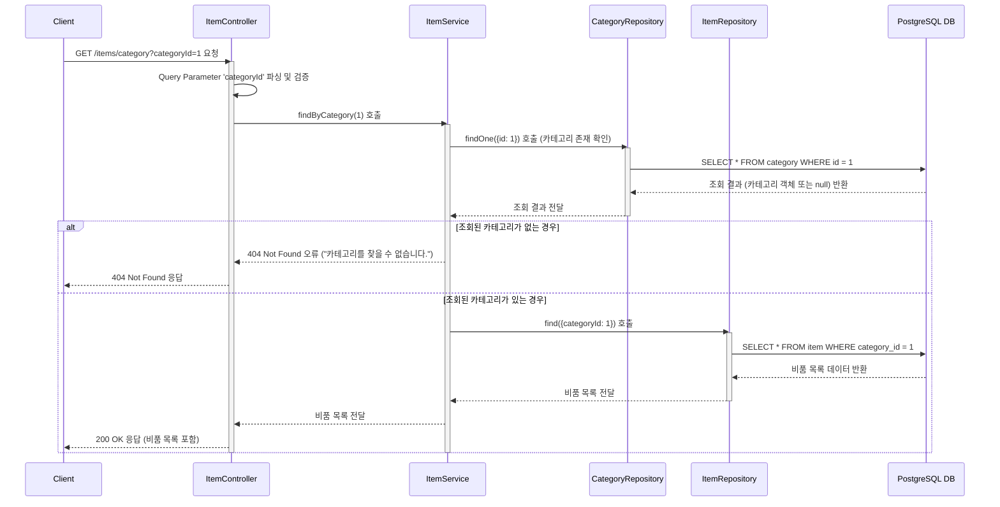

# 카테고리 생성

## 엔드포인트 (Endpoint)

    `GET /items/category?categoryId={id}`

## 기능 설명 (Description)

쿼리 파라미터 `categoryId`에 해당하는 카테고리에 속한 모든 비품 목록을 조회합니다.

## 흐름도

## 상세 설명

### 성공 흐름

1.  **요청**: 사용자가 조회하고 싶은 카테고리의 ID를 쿼리 파라미터 `categoryId`에 담아 `GET /items/category`로 요청합니다.
2.  **유효성 확인**: `Controller`는 `Service`의 `findByCategory()`를 호출합니다. `Service`는 먼저 `CategoryRepository`를 통해 요청된 `categoryId`가 실제로 존재하는 유효한 카테고리인지 확인합니다.
3.  **데이터 조회**: 카테고리가 유효한 것으로 확인되면, `Service`는 `ItemRepository`를 통해 해당 `categoryId`를 가진 모든 비품을 데이터베이스에서 조회합니다.
4.  **성공 응답**: 조회된 비품 목록(해당 카테고리의 비품이 없으면 빈 배열 `[]`)이 `200 OK` 상태 코드와 함께 사용자에게 반환됩니다.

### 예외 처리 (Exception Handling)

- 쿼리 파라미터 `categoryId`가 숫자가 아니거나 누락된 경우, NestJS의 `ParseIntPipe`에 의해 유효성 검사에 실패하여 `400 Bad Request`오류를 반환합니다.
- `categoryId`에 해당하는 카테고리가 데이터베이스에 존재하지 않을 경우, "카테고리를 찾을 수 없습니다." 메시지와 함께 `404 Not Found`오류를 반환합니다.
