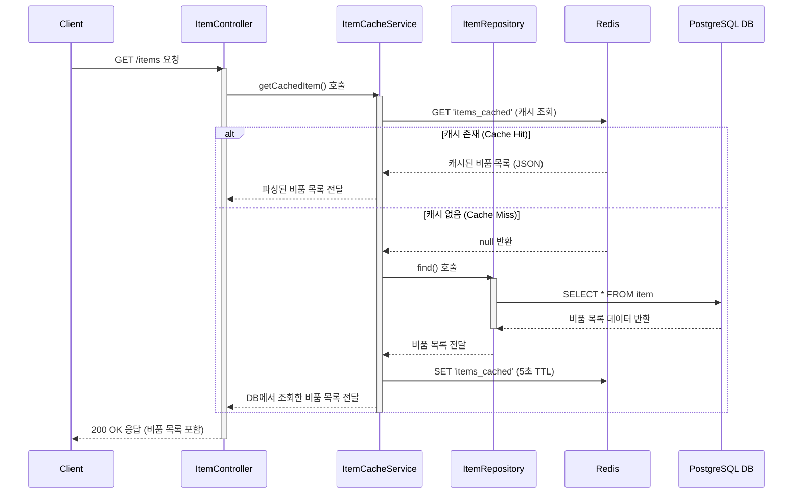

# 카테고리 생성

## 엔드포인트 (Endpoint)

`GET /items`

## 기능 설명 (Description)

시스템에 등록된 모든 비품 목록을 조회합니다. **Redis 캐시**를 적용하여 반복 조회 시 응답 속도를 최적화했습니다.

## 흐름도

## 상세 설명

### 성공 흐름

이 기능의 흐름은 캐시 데이터의 존재 여부에 따라 두가지로 나뉩니다.

1.  **요청**: 사용자가 `GET /items` 엔드포인트로 API를 요청합니다.
2.  **캐시 확인**: `ItemController`는 `ItemCacheService`를 호출합니다. `ItemCacheService`는 가장 먼저 **Redis**에 `items_cached` 키로 저장된 데이터가 있는지 확인합니다.
3.  **분기 처리**:

- **Cache Hit (캐시가 있을 경우)**: Redis에 데이터가 존재하면, DB를 조회하지 않고 즉시 캐시된 데이터를 사용자에게 반환합니다. 이는 매우 빠른 응답 속도를 보장합니다.
- **Cache Miss (캐시가 없을 경우)**:
  - Redis에 데이터가 없으면, `ItemRepository`를 통해 PostgreSQL 데이터베이스에서 전체 비품 목록을 조회합니다.
  - 조회된 목록을 향후 5초간 사용할 수 있도록 Redis에 `items_cached` 라는 키로 저장(캐싱)합니다.
  - 데이터베이스에서 가져온 목록을 사용자에게 반환합니다.

4.  **성공 응답**: 위 과정을 통해 얻은 비품 목록이 `200 OK` 상태 코드와 함께 사용자에게 응답됩니다.

### 예외 처리 (Exception Handling)

- Redis 또는 데이터베이스 연결 실패 등 서버의 일반적인 오류 발생 시, 전역 예외 필터(`AllExceptionsFilter`)가 `500 Internal Server Error`를 반환합니다.
