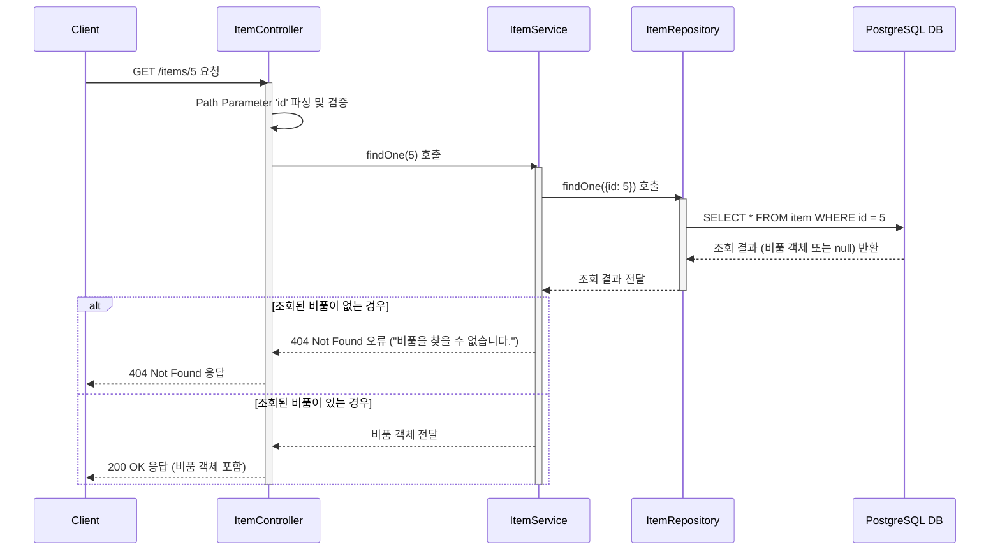

# 카테고리 생성

## 엔드포인트 (Endpoint)

    `GET /items/{id}`

## 기능 설명 (Description)

URL 경로에 포함된 `id`와 일치하는 특정 비품 하나의 상세 정보를 조회합니다.

## 흐름도

## 상세 설명

### 성공 흐름

1.  **요청**: 사용자가 조회하고 싶은 특정 비품의 `id`를 URL 경로에 담아 `GET /items/{id}`로 요청합니다.
2.  **서비스 호출**: `ItemController`는 URL의 `id`를 파싱하여 `ItemService`의 `findOne()` 메서드를 호출합니다.
3.  **데이터 조회**: `Service`는 `ItemRepository`를 통해 `item` 테이블에서 요청된 `id`와 일치하는 비품 데이터를 조회합니다.
4.  **성공 응답**: 조회된 비품 객체가 `200 OK` 상태 코드와 함께 사용자에게 반환됩니다.

### 예외 처리 (Exception Handling)

- URL 경로에 포함된 `id`가 숫자가 아닌 경우, NestJS의 `ParseIntPipe`에 의해 유효성 검사에 실패하여 `400 Bad Request`오류를 반환합니다.
- `id`에 해당하는 비품이 데이터베이스에 존재하지 않을 경우, "비품을 찾을 수 없습니다." 메시지와 함께 `404 Not Found`오류를 반환합니다.
