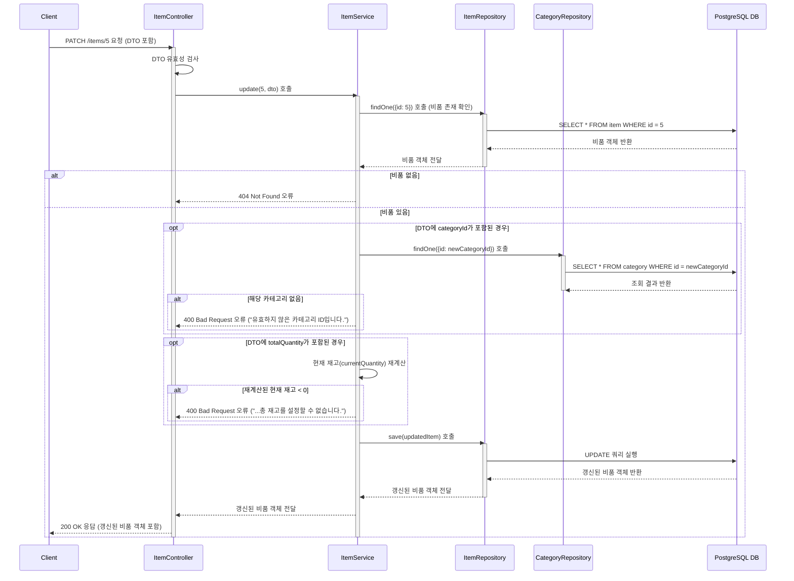

# 카테고리 생성

## 엔드포인트 (Endpoint)

    `PATCH /items/{id}`

## 기능 설명 (Description)

지정된 `id`를 가진 비품의 정보를 수정합니다. `name`, `totalQuantity`, `status`, `categoryId` 등 필요한 필드만 선택적으로 전달하여 수정할 수 있습니다.

## 흐름도

## 상세 설명

### 성공 흐름

1.  **요청 및 유효성 검사**: 사용자가 수정할 비품의 `id`와 정보(DTO)를 담아 `PATCH` 요청을 보냅니다. `Controller`는 먼저 DTO의 유효성을 검사합니다.
2.  **비품 조회**: `Service`는 `id`를 이용해 `ItemRepository`에서 수정할 비품을 조회합니다.
3.  **조건부 로직 수행**: `Service`는 DTO에 포함된 필드에 따라 추가적인 검사와 로직을 수행합니다.

- `categoryId` **변경 시**: 변경하려는 `categoryId`가 실제로 `Category` 테이블에 존재하는지 확인합니다.
- `totalQuantity` **변경 시**: 총 보유 수량의 변화량을 계산하여 현재 대여 가능 수량(`currentQuantity`)에도 반영합니다. (예: 총 수량이 10 → 12로 늘면, 현재 수량도 +2)

4.  **데이터 갱신**: 모든 검사를 통과하면, `Service`는 비품 객체의 정보를 수정한 뒤 `Repository`의 `save()` 메서드를 호출하여 DB에 `UPDATE` 쿼리를 실행합니다.
5.  **성공 응답**: 성공적으로 갱신된 비품 정보가 사용자에게 `200 OK` 상태 코드와 함께 반환됩니다.

### 예외 처리 (Exception Handling)

- **400 Bad Request**:
  - 요청 본문(DTO)의 데이터 형식이 올바르지 않은 경우.
  - 변경하려는 `categoryId`가 DB에 존재하지 않는 경우.
  - `totalQuantity`를 수정했을 때, 계산된 `currentQuantity`(현재 대여 가능 수량)가 0보다 작아지는 경우 (현재 대여된 수량보다 총 재고를 적게 설정하려는 경우).
- **404 Not Found**: URL의 `id`에 해당하는 비품이 존재하지 않을 경우.
