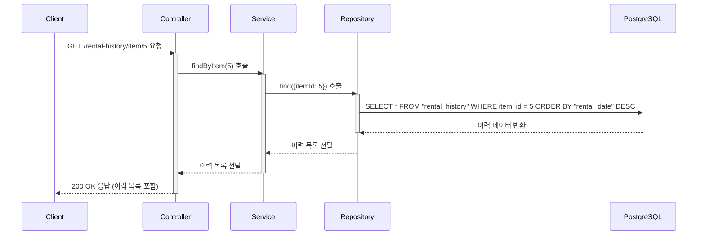

# 카테고리 생성

## 엔드포인트 (Endpoint)

    `GET /rental-history/item/{itemId}`

## 기능 설명 (Description)

URL 경로에 포함된 `itemId`에 해당하는 특정 비품의 모든 대여 및 반납 이력을 조회합니다.

## 흐름도

## 상세 설명

### 성공 흐름

1.  **요청**: 사용자가 이력을 조회할 특정 비품의 `itemId`를 URL 경로에 담아 요청합니다.
2.  **서비스 호출**: `Controller`는 `Service`의 `findByItem()` 메서드를 호출합니다.
3.  **데이터 조회**: `Service`는 `Repository`를 통해 `rental_history` 테이블에서 `itemId`가 일치하는 모든 이력을 조회합니다.
4.  **성공 응답**: 조회된 이력 목록(이력이 없으면 빈 배열 `[]`)이 `200 OK` 상태 코드와 함께 사용자에게 반환됩니다..

### 예외 처리 (Exception Handling)

- `400 Bad Request`: URL의 `itemId`가 숫자가 아닌 경우 오류를 반환합니다.
