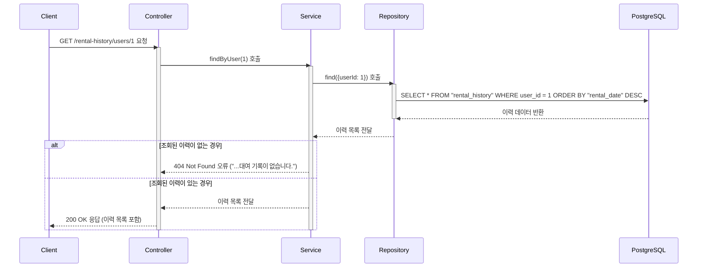

# 카테고리 생성

## 엔드포인트 (Endpoint)

`GET /rental-history/users/{userId}`

## 기능 설명 (Description)

URL 경로에 포함된 `userId`에 해당하는 특정 사용자의 모든 대여 및 반납 이력을 조회합니다.

## 흐름도

## 상세 설명

### 성공 흐름

1.  **요청**: 사용자가 이력을 조회할 특정 사용자의 `userId`를 URL 경로에 담아 요청합니다.
2.  **서비스 호출**: `Controller`는 `Service`의 `findByUser()` 메서드를 호출합니다.
3.  **데이터 조회**: `Service`는 `Repository`를 통해 `userId`가 일치하는 모든 이력을 조회합니다.
4.  **성공 응답**: 조회된 이력이 하나 이상일 경우, 해당 이력 목록이 `200 OK` 상태 코드와 함께 사용자에게 반환됩니다.

### 예외 처리 (Exception Handling)

- `400 Bad Request`: URL의 `userId`가 숫자가 아닌 경우 오류를 반환합니다.
- `404 Not Found`: 조회된 대여 기록이 하나도 없을 경우, "해당 사용자의 대여 기록이 없습니다." 메시지와 함께 오류를 반환합니다.
