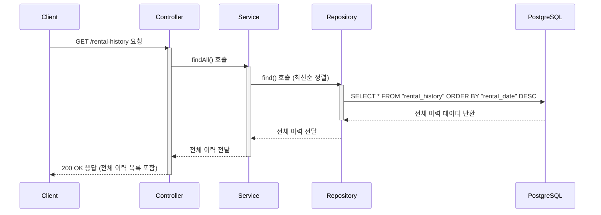

# 카테고리 생성

## 엔드포인트 (Endpoint)

    `GET /rental-history`

## 기능 설명 (Description)

시스템에 기록된 모든 대여 및 반납 이력 전체를 조회합니다. 결과는 대여일(`rentalDate`) 기준 최신순으로 정렬됩니다.

## 흐름도

## 상세 설명

### 성공 흐름

1.  **요청**: 사용자가 `GET /rental-history` 엔드포인트로 API를 요청합니다
2.  **서비스 호출**: `Controller`는 `Service`의 `findAll()` 메서드를 호출합니다.
3.  **데이터 조회**: `Service`는 `Repository`를 통해 데이터베이스에서 모든 대여/반납 이력을 조회합니다.
4.  **성공 응답**: 조회된 전체 이력 목록(이력이 없으면 빈 배열 `[]`)이 `200 OK` 상태 코드와 함께 사용자에게 반환됩니다.

### 예외 처리 (Exception Handling)

- 이 기능은 특정 비즈니스 로직에 따른 예외를 발생시키지 않습니다. 데이터베이스 연결 실패 등 서버의 일반적인 오류 발생 시, 전역 예외 필터(`AllExceptionsFilter`)가 `500 Internal Server Error`를 반환합니다.
