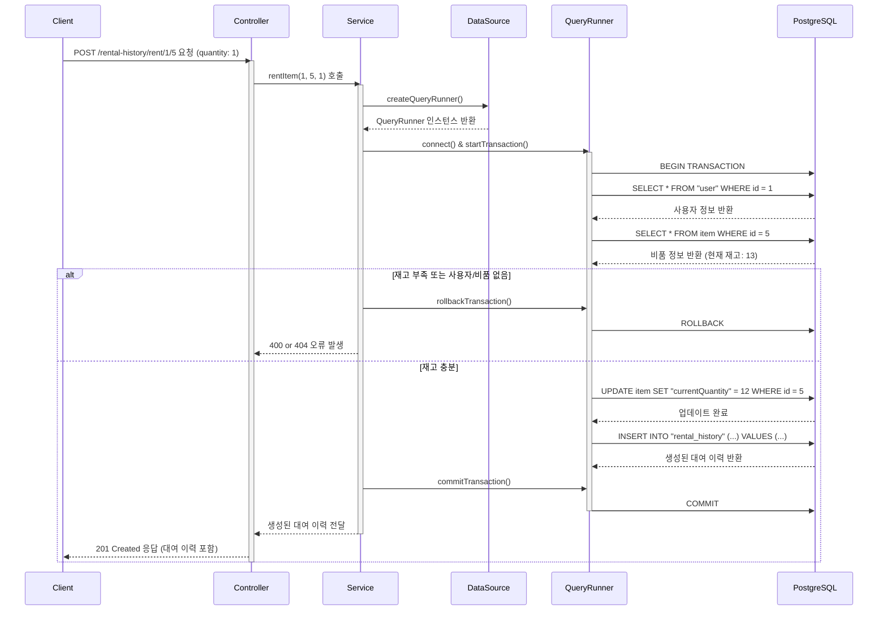

# 카테고리 생성

## 엔드포인트 (Endpoint)

    `POST /rental-history/rent/{userId}/{itemId}`

## 기능 설명 (Description)

특정 사용자(`userId`)가 특정 비품(`itemId`)을 지정된 수량(`quantity`)만큼 대여합니다. 이 과정은 **데이터베이스 트랜잭션**으로 처리되어, 재고 차감과 대여 이력 생성이 모두 성공해야만 최종 반영됩니다.

## 흐름도

## 상세 설명

### 성공 흐름

1.  **요청 및 트랜잭션 시작**: 사용자가 대여할 `userId`, `itemId`, 그리고 수량(`quantity`)을 담아 요청합니다. `Service`는 요청을 받자마자 데이터 정합성을 위해 **데이터베이스 트랜잭션**을 시작합니다.
2.  **유효성 검증**: 트랜잭션 내에서 `Service`는 다음을 순서대로 확인합니다.

- `userId`에 해당하는 사용자가 실제로 존재하는지 조회합니다.
- `itemId`에 해당하는 비품이 실제로 존재하는지 조회합니다.
- 해당 비품의 현재 재고(`currentQuantity`)가 대여하려는 수량(`quantity`)보다 충분한지 확인합니다.

3.  **데이터 갱신**: 모든 검증을 통과하면, 다음 두 가지 작업을 순서대로 실행합니다.

- `item` 테이블의 `currentQuantity`를 대여한 수량만큼 차감하여 `UPDATE` 합니다.
- `rental_history` 테이블에 대여 기록을 `INSERT` 합니다.

4.  **트랜잭션 커밋 및 응답**: 모든 DB 작업이 오류 없이 완료되면, `Service`는 트랜잭션을 **커밋(Commit)** 하여 모든 변경사항을 DB에 영구적으로 저장하고, 생성된 대여 이력 정보를 사용자에게 `201 Created` 상태 코드로 응답합니다.

### 예외 처리 (Exception Handling)

- `400 Bad Request`: 요청 본문의 `quantity`가 유효하지 않거나, 대여하려는 비품의 재고가 부족할 경우 오류를 반환합니다.
- `404 Not Found`: URL의 `userId` 또는 `itemId`에 해당하는 데이터가 존재하지 않을 경우 오류를 반환합니다.
- **트랜잭션 롤백**: 위 과정 중 하나라도 실패하면, `Service`는 트랜잭션을 **롤백(Rollback)** 하여 재고 차감을 포함한 모든 변경사항을 이전 상태로 되돌립니다.
