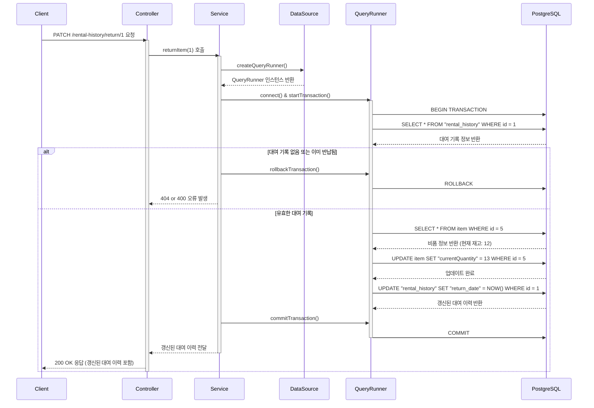

# 카테고리 생성

## 엔드포인트 (Endpoint)

`PATCH /rental-history/return/{rentId}`

## 기능 설명 (Description)

URL 경로에 포함된 대여 기록 ID(`rentId`)를 통해 해당 대여 건을 '반납' 처리합니다. 반납된 수량만큼 비품의 재고가 다시 증가하며, 이 과정은 **데이터베이스 트랜잭션**으로 처리됩니다.

## 흐름도

## 상세 설명

### 성공 흐름

1.  **요청 및 트랜잭션 시작**: 사용자가 반납할 대여 기록의 `rentId`를 담아 요청합니다. Service는 **데이터베이스 트랜잭션**을 시작합니다.
2.  **유효성 검증**: 트랜잭션 내에서 `Service`는 다음을 확인합니다.

- `rentId`에 해당하는 대여 기록이 존재하는지, 그리고 아직 반납되지 않은 상태(`returnDate`가 null)인지 조회합니다.
- 해당 대여 기록에 명시된 `itemId`의 비품이 실제로 존재하는지 조회합니다.

3.  **데이터 변경**: 모든 검증을 통과하면, 다음 두 가지 작업을 순서대로 실행합니다.

- `item` 테이블의 `currentQuantity`를 대여 기록에 있던 `quantity`만큼 다시 더하여 `UPDATE` 합니다.
- `rental_history` 테이블의 `returnDate` 컬럼에 현재 시간을 기록하여 `UPDATE` 합니다.

4.  **트랜잭션 커밋 및 응답**: 모든 DB 작업이 오류 없이 완료되면, `Service`는 트랜잭션을 **커밋(Commit)**하여 모든 변경사항을 DB에 영구적으로 저장하고, 반납 처리된 대여 이력 정보를 사용자에게 `200 OK` 상태 코드로 응답합니다.

### 예외 처리 (Exception Handling)

- `400 Bad Request`: 이미 반납 처리된 대여 기록(`returnDate`가 이미 설정됨)을 다시 반납하려고 시도할 경우 오류를 반환합니다.
- `404 Not Found`: URL의 `rentId`에 해당하는 대여 기록이 존재하지 않을 경우 오류를 반환합니다.
- **트랜잭션 롤백**: 위 과정 중 하나라도 실패하면, `Service`는 트랜잭션을 **롤백(Rollback)**하여 모든 변경사항을 이전 상태로 되돌립니다.
