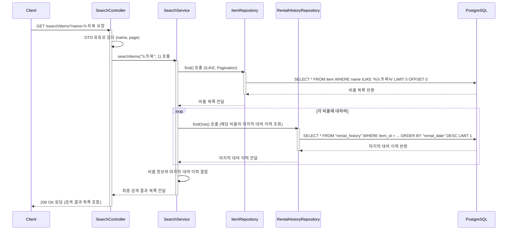

# 카테고리 생성

## 엔드포인트 (Endpoint)

    `GET /search/items?name={keyword}&page={page_number}`

## 기능 설명 (Description)

쿼리 파라미터 `name`에 포함된 키워드로 비품을 검색합니다. 검색은 대소문자를 구분하지 않으며, **페이지네이션**을 지원합니다. 각 검색 결과에는 해당 비품의 **마지막 대여 이력**이 포함됩니다.

## 흐름도

## 상세 설명

### 성공 흐름

1.  **요청 및 유효성 검사**: 용자가 검색할 키워드(`name`)와 페이지 번호(`page`)를 쿼리 파라미터에 담아 요청합니다. `Controller`는 DTO를 통해 `name`이 2글자 이상인지 등의 유효성을 검사합니다.
2.  **페이지네이션 비품 조회**: `Service`는 `ItemRepository`를 통해 `ILIKE` 연산자로 대소문자 구분 없이 키워드에 맞는 비품을 조회합니다. 이때 `page` 번호를 기반으로 페이지네이션(기본 5개씩)을 적용합니다.
3.  **마지막 대여 이력 조회**: 1단계에서 조회된 각 비품에 대해, `RentalHistoryRepository`를 조회하여 해당 비품의 가장 최근 대여/반납 이력을 하나씩 찾아냅니다.
4.  **데이터 조합 및 응답**: `Service`는 비품 정보와 해당 비품의 마지막 대여 이력 정보를 합쳐서 최종 결과 목록을 만듭니다. 이 목록이 `200 OK` 상태 코드와 함께 사용자에게 반환됩니다.

### 예외 처리 (Exception Handling)

- `400 Bad Request`: `name`이 2글자 미만이거나, `page`가 1 미만의 정수인 경우 등 DTO 유효성 검사를 통과하지 못하면 오류를 반환합니다.
