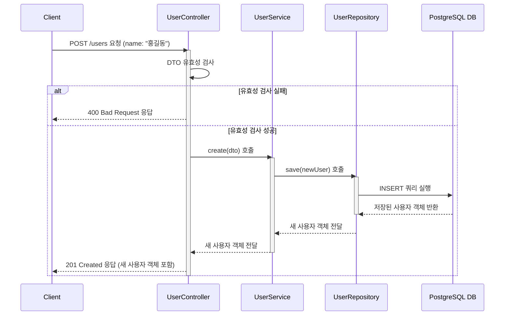

# 카테고리 생성

## 엔드포인트 (Endpoint)

    `POST /users`

## 기능 설명 (Description)

새로운 사용자를 시스템에 등록합니다

## 흐름도

## 상세 설명

### 성공 흐름

1.  **요청 및 유효성 검사**: 사용자가 생성할 사용자 이름(`name`)을 `Request Body`에 담아 `POST /users`로 요청합니다. `Controller`는 DTO 유효성 검사를 통해 `name` 필드가 비어있지 않고 문자열인지 확인합니다.
2.  **데이터 저장**: 유효성 검사를 통과하면 `Controller`는 `Service`의 `create()` 메서드를 호출합니다. `Service`는 받은 DTO를 기반으로 새로운 사용자 객체를 생성하고, `Repository`의 `save()` 메서드를 호출하여 데이터베이스에 저장합니다.
3.  **성공 응답**: 데이터베이스에 성공적으로 저장되면, `id`가 부여된 새로운 사용자 객체가 생성되어 사용자에게 `201 Created` 상태 코드와 함께 반환됩니다.

### 예외 처리 (Exception Handling)

- 요청한 `name` 값이 비어있거나, 문자열이 아니거나, 필드가 누락되는 등 유효성 검사를 통과하지 못할 경우 `400 Bad Request` 오류를 반환합니다.
