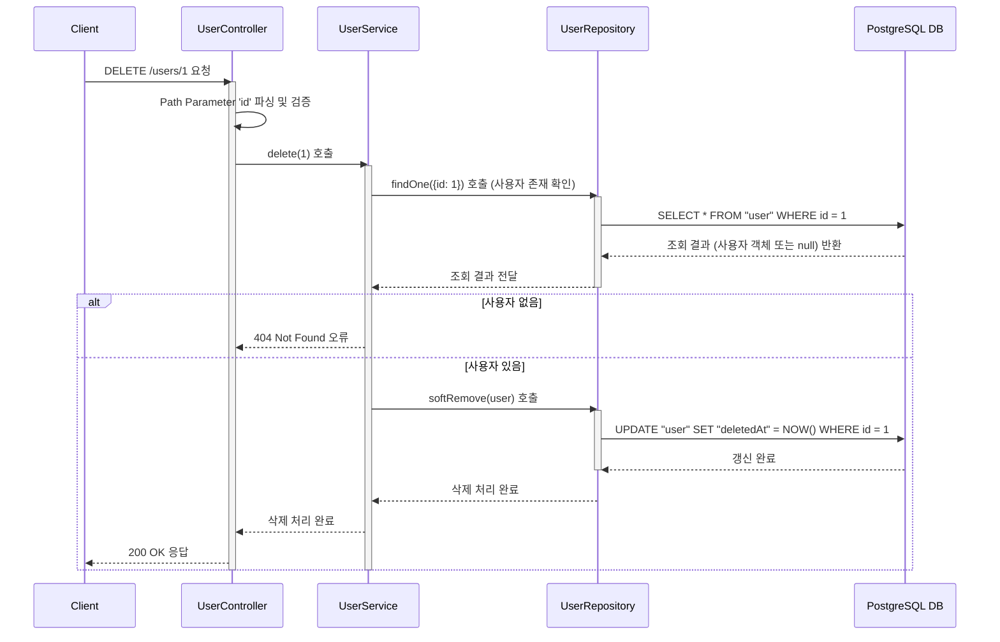

# 카테고리 생성

## 엔드포인트 (Endpoint)

    `DELETE /users/{id}`

## 기능 설명 (Description)

지정된 `id`를 가진 사용자를 **소프트 삭제(Soft Delete)**합니다. 데이터베이스에서 실제 행이 삭제되지 않고, `deletedAt` 컬럼에 삭제된 시간이 기록됩니다.

## 흐름도

## 상세 설명

### 성공 흐름

1.  **요청**: 사용자가 삭제할 사용자의 `id`를 URL 경로에 담아 `DELETE /users/{id}`로 요청합니다.
2.  **사용자 조회**: `Service`는 `id`를 이용해 `Repository`에서 해당 사용자가 존재하는지 먼저 조회합니다.
3.  **소프트 삭제 실행**: 사용자가 존재하면, `Repository`의 `softRemove()` 메서드를 호출합니다. 이 메서드는 DB에서 행을 직접 삭제하는 대신, 해당 행의 `deletedAt` 컬럼에 현재 시간을 기록하여 '삭제된 상태'로 처리합니다.
4.  **성공 응답**: 삭제가 성공적으로 완료되면 사용자에게 `200 OK` 상태 코드를 응답합니다.

### 예외 처리 (Exception Handling)

- **400 Bad Request**: URL 경로에 포함된 `id`가 숫자가 아닌 경우 오류를 반환합니다.
- **404 Not Found**: `id`에 해당하는 사용자가 존재하지 않을 경우 오류를 반환합니다.
