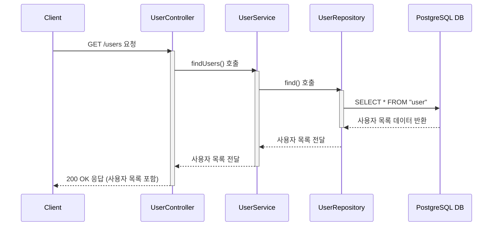

# 카테고리 생성

## 엔드포인트 (Endpoint)

    `GET /users`

## 기능 설명 (Description)

    시스템에 등록된 모든 사용자 목록을 조회하여 배열 형태로 반환합니다.

## 흐름도

## 상세 설명

### 성공 흐름

1.  **요청**: 사용자가 `GET /users` 엔드포인트로 API를 요청합니다.
2.  **서비스 호출**: `UserController`는 `UserService`의 `findUsers()` 메서드를 호출합니다
3.  **데이터 조회**: `UserService`는 `UserRepository`를 통해 데이터베이스에서 모든 사용자 목록을 조회합니다.
4.  **성공 응답**: 조회된 사용자 목록(사용자가 없으면 빈 배열 `[]`)이 `200 OK` 상태 코드와 함께 사용자에게 반환됩니다.

### 예외 처리 (Exception Handling)

- 데이터베이스 연결 오류 등 서버의 일반적인 문제 발생 시, 전역 예외 필터(AllExceptionsFilter)가 `500 Internal Server Error`를 반환합니다.
