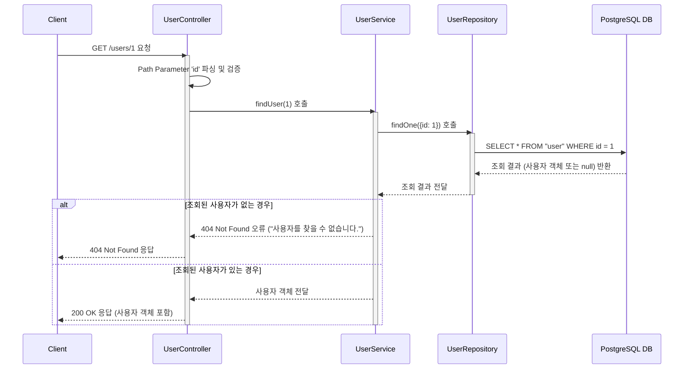

# 카테고리 생성

## 엔드포인트 (Endpoint)

    `GET /users{id}`

## 기능 설명 (Description)

    URL 경로에 포함된 `id`와 일치하는 특정 사용자 한 명의 정보를 조회합니다.

## 흐름도

## 상세 설명

### 성공 흐름

1.  **요청**: 사용자가 조회할 특정 사용자의 `id`를 URL 경로에 담아 `GET /users/{id}`로 요청합니다.
2.  **서비스 호출**: `UserController`는 URL의 `id`를 파싱하여 `UserService`의 `findUser()` 메서드를 호출합니다.
3.  **데이터 조회**: `UserService`는 `UserRepository`를 통해 요청된 `id`와 일치하는 사용자를 데이터베이스에서 조회합니다.
4.  **성공 응답**: 조회된 사용자 객체가 `200 OK` 상태 코드와 함께 사용자에게 반환됩니다.

### 예외 처리 (Exception Handling)

- URL 경로에 포함된 `id`가 숫자가 아닌 경우, `ParseIntPipe`에 의해 `400 Bad Request`오류를 반환합니다.
- `id`에 해당하는 사용자가 데이터베이스에 존재하지 않을 경우, "사용자를 찾을 수 없습니다." 메시지와 함께 `404 Not Found`오류를 반환합니다.
