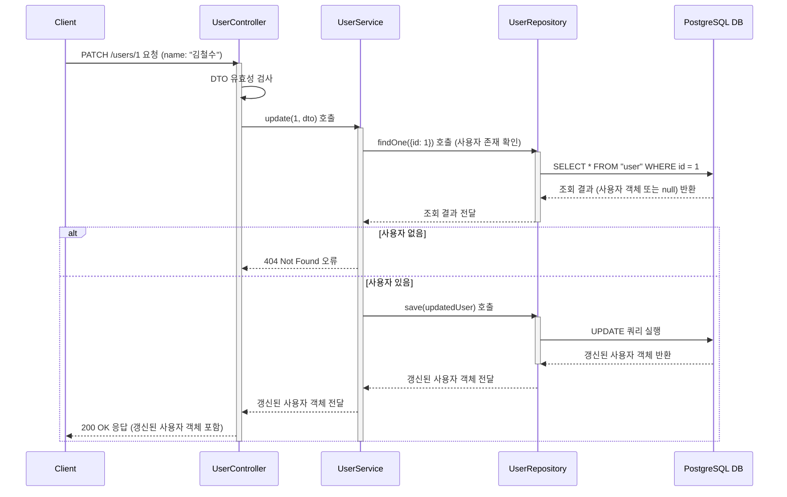

# 카테고리 생성

## 엔드포인트 (Endpoint)

    `PATCH /users/{id}`

## 기능 설명 (Description)

지정된 `id`를 가진 사용자의 정보를 수정합니다.

## 흐름도

## 상세 설명

### 성공 흐름

1.  **요청 및 유효성 검사**: 사용자가 수정할 사용자의 `id`와 정보(`name`)를 담아 `PATCH` 요청을 보냅니다. `Controller`는 먼저 DTO의 유효성을 검사합니다.
2.  **사용자 조회**: `Service`는 `id`를 이용해 `Repository`에서 해당 사용자가 존재하는지 조회합니다.
3.  **데이터 갱신**: 사용자가 존재하면, `Service`는 DTO의 내용으로 사용자 객체의 정보를 수정한 뒤 `Repository`의 `save()` 메서드를 호출하여 DB에 `UPDATE` 쿼리를 실행합니다.
4.  **성공 응답**: 성공적으로 갱신된 사용자 정보가 `200 OK` 상태 코드와 함께 반환됩니다.

### 예외 처리 (Exception Handling)

- **400 Bad Request**: DTO 유효성 검사를 통과하지 못할 경우 오류를 반환합니다.
- **404 Not Found**: URL의 `id`에 해당하는 사용자가 존재하지 않을 경우 오류를 반환합니다.
